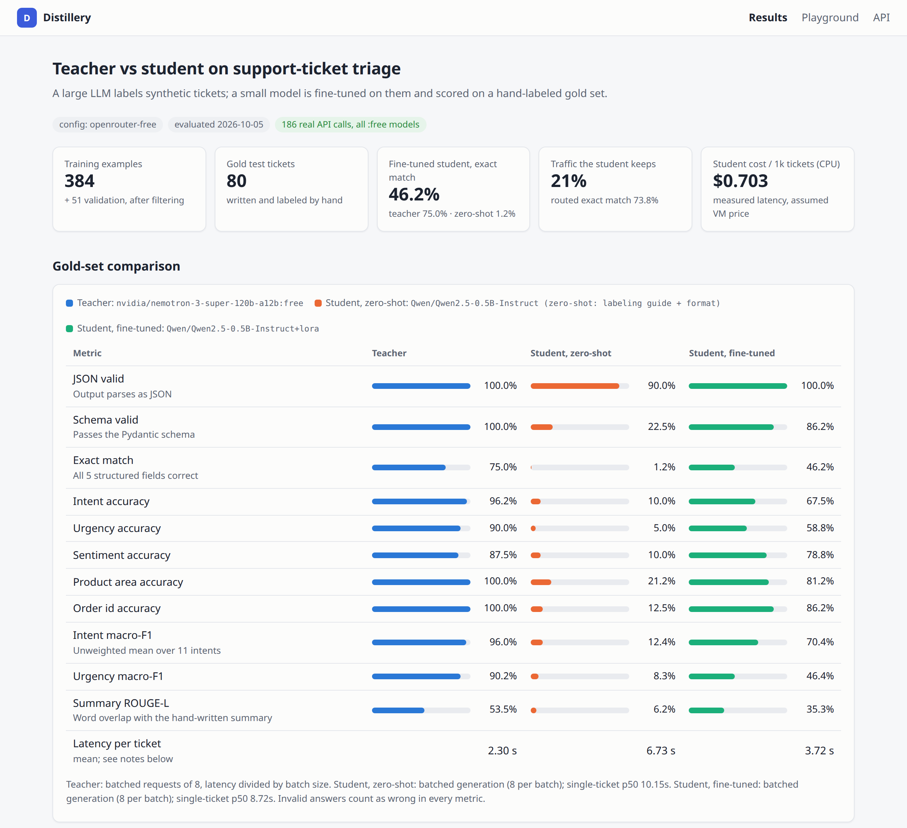
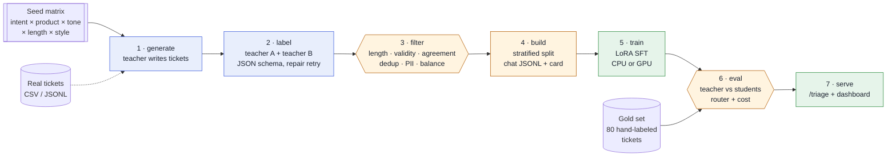
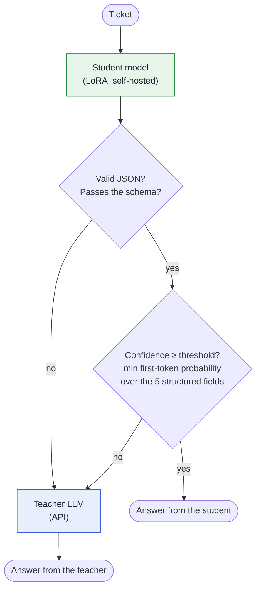
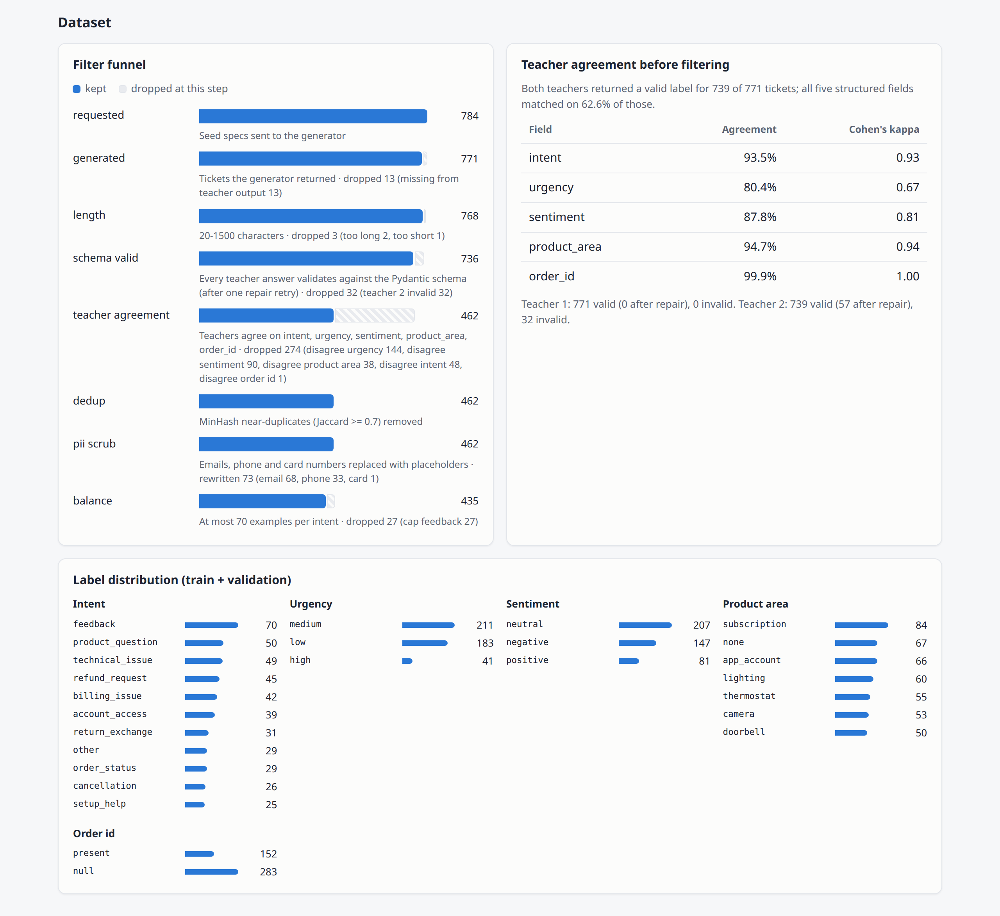
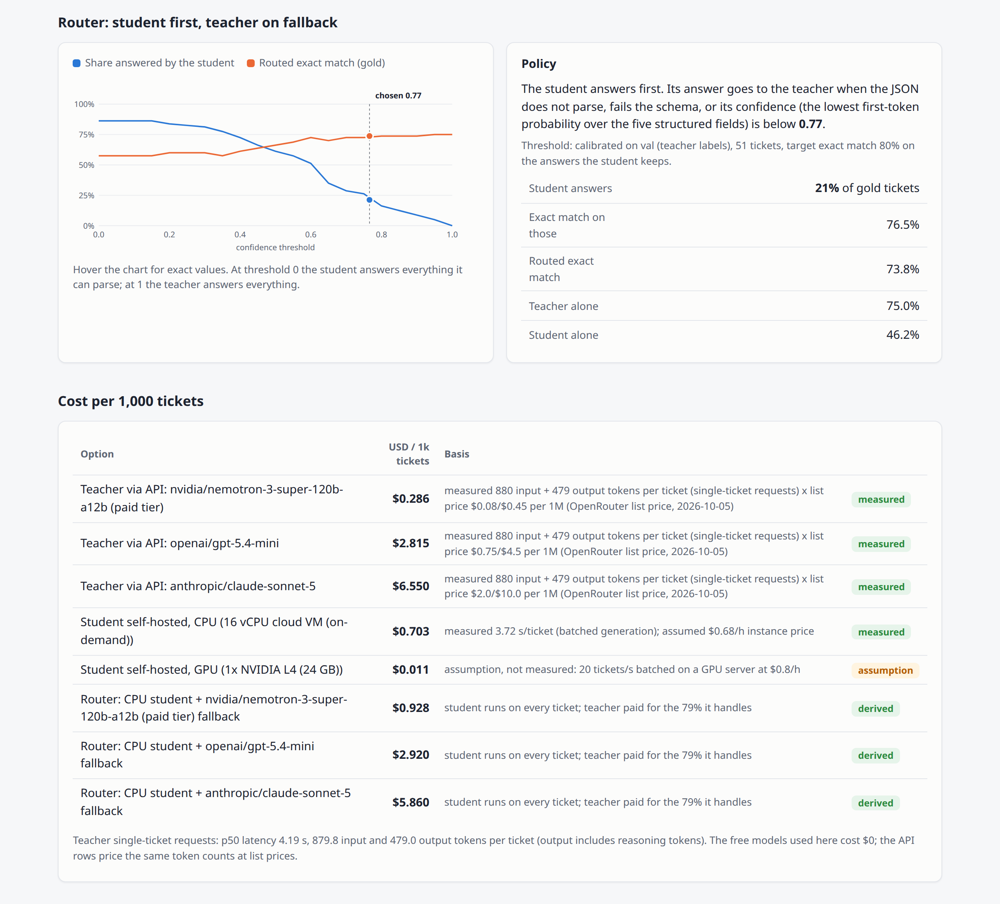
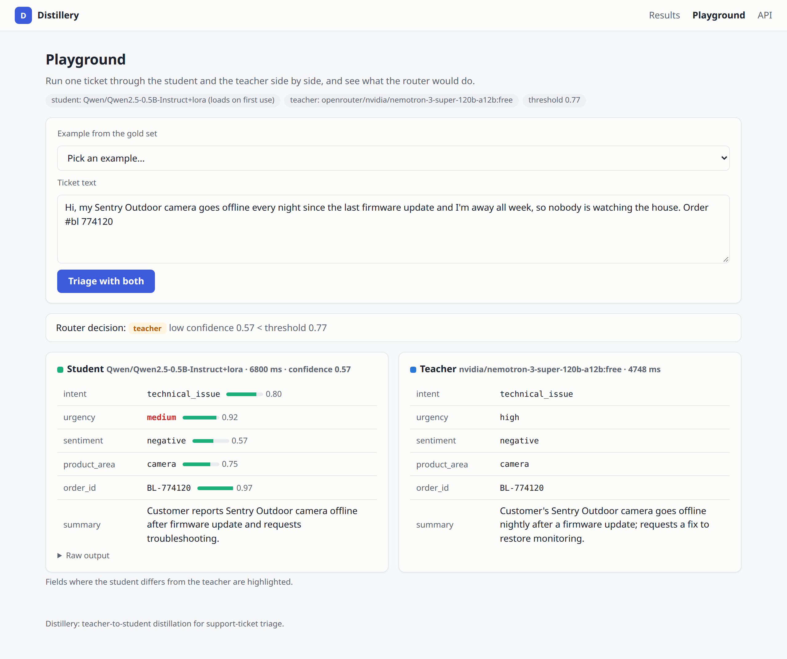

# Distillery: distill a large LLM into a small, cheap model for one task

**Turn an expensive LLM call into a small model you can run on your own server, and measure with real numbers whether it is good enough.**

[](https://github.com/gelevanog/llm-distillation-pipeline/actions/workflows/ci.yml)




**Real run, 2026-10-05** (free OpenRouter teachers, Qwen2.5-0.5B student fine-tuned on a 16-core CPU, scored on 80 hand-labeled tickets):

| | Exact match (all 5 fields) | Intent accuracy | Valid JSON / valid schema | Latency per ticket | Cost per 1k tickets |
|---|---:|---:|---:|---:|---:|
| Teacher `nvidia/nemotron-3-super-120b-a12b:free` | **75.0%** | 96.2% | 100% / 100% | 4.2 s (single request, p50) | $0 free tier; $0.29 at its paid list price |
| Student before fine-tuning (zero-shot) | 1.2% | 10.0% | 90% / 22.5% | 6.7 s (batched, CPU)* | – |
| Student after LoRA fine-tuning | **46.2%** | 67.5% | 100% / 86.2% | 3.7 s (batched, CPU) | $0.70 (CPU VM) |
| Router: student first, teacher on fallback | **73.8%** | 96.2% | 100% / 100% | | student keeps **21%** of tickets |

<sub>*zero-shot uses a much longer prompt (the full labeling guide), so it is slower than the fine-tuned student. Cost assumptions are in [Cost](#cost-per-1000-tickets).</sub>

**The honest verdict:** fine-tuning took the tiny student from unusable (1%) to 46% exact match on 384 synthetic examples and one CPU hour, but a 0.5B model on a CPU is **not** good enough to replace the teacher, and on CPU it is not even cheaper than a small paid open-weight API model. With the router it still takes over a fifth of the traffic at almost the teacher's quality (73.8% vs 75.0%). The fix is a bigger student on a GPU (config included, not run here), which is exactly the kind of decision this pipeline is built to inform.

## What problem it solves

Many companies use a large LLM (GPT, Claude, Gemini) for one narrow job that repeats thousands of times a day: sorting support tickets, extracting fields from emails, tagging documents. Paying a frontier model per request for that is expensive and slow, and sometimes the data is not allowed to leave the company at all. A small open model, trained on the large model's answers ("distillation"), can do the same narrow job on your own hardware for a fraction of the cost.

The hard part is knowing **when that is good enough**. Distillery is a complete, reproducible pipeline for one concrete task, triaging customer-support tickets into strict JSON, that:

1. uses a large "teacher" LLM to write and label training data,
2. cleans that data with deterministic, explainable rules,
3. fine-tunes a small "student" model with LoRA,
4. scores teacher and student on tickets written and labeled **by hand**, and
5. serves the student behind a router that hands uncertain tickets back to the teacher, reporting how much traffic the student can take over and what that saves.

The point is the measurement, not a promise. The numbers below include the parts where the tiny CPU student falls short.

## Features

- **Seven stages, one YAML config**: `distillery generate | label | filter | build | train | eval | report`, or `run-all`. Every stage reads and writes plain JSONL/JSON in a run directory, so each one can be inspected, re-run or replaced.
- **Synthetic data with a seed matrix**: intent × product × tone × length × writing style (typos, lowercase chat, non-native English, formal email) × order number × contact details, several tickets per call. Real unlabeled tickets can be imported from CSV/JSONL instead or in addition.
- **Validated teacher labels**: native JSON-schema structured output, Pydantic validation, and a **repair retry** that sends the validator's error messages back to the teacher.
- **Self-consistency**: every ticket is labeled by two different teacher models; per-field agreement and Cohen's kappa are reported, and disagreements are filtered out.
- **Deterministic filters with a funnel**: length bounds, schema validity, teacher agreement, **MinHash near-duplicate** removal, **PII scrubbing** (emails, phones, card numbers → placeholders, also before data is sent to the teacher), and per-intent balance caps. Every dropped ticket is logged with its reason.
- **Dataset build**: stratified train/validation split, chat-format JSONL for SFT, and a generated dataset card.
- **LoRA fine-tuning** with Hugging Face `transformers` + `peft` (loss on the answer tokens only). A CPU config that trains in about an hour on 16 cores, and a GPU config for a bigger student.
- **Honest evaluation on a hand-labeled gold set** (80 tickets, never generated by a teacher): JSON validity, schema validity, per-field accuracy, macro-F1, exact match, latency, cost per 1,000 tickets. Teacher vs student zero-shot vs student fine-tuned.
- **Router with teacher fallback**: the student answers first; invalid JSON, schema failures and low-confidence answers (token-probability based) go to the teacher. The threshold is calibrated on the validation split and the offload rate is measured on the gold set.
- **Dashboard and playground** (FastAPI + Jinja2 + htmx, no build step): funnel, dataset stats, comparison table, router trade-off chart, cost table, and a side-by-side teacher vs student playground. The same page renders as a self-contained `report.html`.
- **Any teacher, one switch**: OpenAI, Anthropic, OpenRouter (with a `models` fallback list) or a deterministic offline `fake` provider. A **free-only guard** refuses any OpenRouter model id that does not end in `:free`.
- **Budget-safe API use**: disk cache (re-runs cost nothing), throttling, retries with exponential backoff, a hard call budget per run, and a call ledger (`calls.jsonl`) that records every real request.
- **Production basics**: typed code (mypy strict), structured logs, Docker image, GitHub Actions CI (lint, tests incl. a tiny-model training test, a full offline pipeline run, Docker build).

## How it works



Blue stages call the teacher LLM, orange stages are deterministic code, green stages run the student. The gold set is written and labeled by hand: no teacher generates or labels it and it is never used for training; the teacher only sees it when the teacher itself is being scored.

**The router at serving time.** The student always runs first because it is cheap; the teacher is paid only for the tickets the student should not handle.



## The task

Input: a customer's message to Brightloop, a fictional online store for smart-home devices (bulbs and light strips, thermostats, cameras, doorbells, a mobile app and a cloud-video subscription). Output: one strict JSON object ([`schema.py`](src/distillery/schema.py)):

```json
{"intent": "technical_issue", "urgency": "high", "sentiment": "neutral", "product_area": "thermostat",
 "order_id": null, "summary": "Thermostat stopped heating after the 3.2 firmware update; the home is 14°C with a baby."}
```

| Field | Values |
|---|---|
| `intent` | `order_status`, `refund_request`, `return_exchange`, `billing_issue`, `cancellation`, `technical_issue`, `setup_help`, `account_access`, `product_question`, `feedback`, `other` |
| `urgency` | `low`, `medium`, `high` (safety/security risks, no heating or cooling, hacked accounts, deadlines within 48 h, chargeback threats, third contact) |
| `sentiment` | `negative`, `neutral`, `positive` |
| `product_area` | `lighting`, `thermostat`, `camera`, `doorbell`, `app_account`, `subscription`, `none` |
| `order_id` | `BL-` + 6 digits, normalized from whatever the customer wrote (`#bl 482913`, `order 482913`), or `null` |
| `summary` | one sentence, at most 25 words |

The labeling guide in [`prompts.py`](src/distillery/prompts.py) defines every label with tie-break rules (for example, an unexpected charge is `billing_issue` even when the customer asks for the money back). The teachers get the full guide; the gold set was labeled by hand against the same guide.

## Real run: free OpenRouter models, CPU student (2026-10-05)

Everything below was produced by `configs/openrouter-free.yaml` on 2026-10-05, on a machine with 16 CPU cores and no GPU (the generation pass ran with 3 requests in flight; the config was raised to 5 before labeling). The small artifacts are committed in [`results/openrouter-free-2026-10-05/`](results/openrouter-free-2026-10-05): the full train/validation set and its [dataset card](results/openrouter-free-2026-10-05/dataset/README.md), the funnel, agreement stats, training metrics, the [eval report](results/openrouter-free-2026-10-05/eval/report.json) with per-ticket predictions of all three systems, the static [`report.html`](results/openrouter-free-2026-10-05/report.html), and the call ledger. The LoRA adapter (35 MB) is not committed; `distillery train` rebuilds it from the committed dataset.

| Role | Model (all `:free` on OpenRouter) |
|---|---|
| Generator | `qwen/qwen3.8-27b:free` (OpenRouter fell back to `nvidia/nemotron-3-super-120b-a12b:free` for 11 of 49 calls) |
| Teacher 1 (and "the teacher" in the eval) | `nvidia/nemotron-3-super-120b-a12b:free`, reasoning effort low |
| Teacher 2 (self-consistency) | `dots-studio/dots-3-note-preview:free`, reasoning effort low |
| Student | `Qwen/Qwen2.5-0.5B-Instruct` + LoRA (r=16, all linear layers), CPU |

### Data: 784 requested → 435 clean examples



| Step | Kept | Dropped | Why |
|---|---:|---:|---|
| Requested seeds | 784 | | 720 across all intents + a 64-seed top-up for `other` (see below) |
| Generated | 771 | 13 | one batch was cut off at `max_tokens` (5 of 16 salvaged), a few batches returned 15 of 16 |
| Length 20–1,500 chars | 768 | 3 | 2 too long, 1 too short |
| Schema valid (both teachers) | 736 | 32 | teacher 2 lost two batches of 16: one upstream `400`, one blocked by the upstream content filter. 57 of its answers were invalid at first and fixed by the **repair retry** |
| Teachers agree on all 5 fields | 462 | 274 | urgency 144, sentiment 90, intent 48, product area 38, order id 1 (a ticket can fail several) |
| MinHash dedup (Jaccard ≥ 0.7) | 462 | 0 | the seed matrix produced no near-duplicates |
| PII scrub | 462 | | 73 tickets rewritten: 68 emails, 33 phone numbers, 1 card number |
| Per-intent cap (70) | **435** | 27 | `feedback` was over-represented |

Teacher agreement before filtering (739 tickets with two valid labels): all five fields matched on **62.6%**. Per field: intent 93.5% (Cohen's kappa 0.93), product area 94.7% (0.94), order id 99.9% (1.00), sentiment 87.8% (0.81), urgency 80.4% (0.67). Urgency is the most subjective field for the models too.

**What the first pass got wrong, and the fix.** After the first 720 seeds only **1** `other` ticket (spam, partnership pitches, job applications) survived: the generator wrote the `other` seeds as ordinary praise or questions, because the generation prompt did not say what `other` means. The generation prompt now defines every topic, and a top-up pass (`distillery generate --append --num 64 --topic other --prefix o`) added 64 `other` seeds, of which 29 survived the filters. The dataset card shows the final mix: from 70 `feedback` down to 25 `setup_help`.

### Evaluation on the hand-labeled gold set (80 tickets)


| Metric | Teacher (nemotron-3-super, free) | Student zero-shot | Student fine-tuned |
|---|---:|---:|---:|
| Valid JSON | 100% | 90.0% | **100%** |
| Valid schema (enums, order-id format) | 100% | 22.5% | 86.2% |
| **Exact match, all 5 structured fields** | **75.0%** | 1.2% | **46.2%** |
| Intent accuracy / macro-F1 | 96.2% / 0.96 | 10.0% / 0.12 | 67.5% / 0.70 |
| Urgency accuracy / macro-F1 | 90.0% / 0.90 | 5.0% / 0.08 | 58.8% / 0.46 |
| Sentiment accuracy / macro-F1 | 87.5% / 0.89 | 10.0% / 0.21 | 78.8% / 0.80 |
| Product area accuracy / macro-F1 | 100% / 1.00 | 21.2% / 0.30 | 81.2% / 0.88 |
| Order id accuracy | 100% | 12.5% | 86.2% |
| Summary ROUGE-L vs hand-written | 0.54 | 0.06 | 0.35 |
| Latency per ticket | 2.3 s batched (8 per request), 4.2 s single request p50 | 6.7 s batched on CPU | 3.7 s batched on CPU, 8.7 s single ticket p50 |

Invalid answers count as wrong in every field. The zero-shot student was given the teacher's full labeling guide plus the exact output format (the strongest fair prompt; with the guide alone it produced 0 of 8 schema-valid answers in a smoke test).

**Reading the numbers:**

- **The teacher is not 100% right either.** Its 20 misses are mostly borderline calls the gold set makes differently: reading a factual problem report as `negative` sentiment (10 tickets), urgency one level off (8, mostly `medium` instead of `low` for routine returns and exchanges), and `product_question` or `technical_issue` for installation questions the guide files under `setup_help` (3). A student trained on teacher labels inherits these conventions, so ~75% is roughly its ceiling on this gold set.
- **Fine-tuning works, a 0.5B model is still too small.** From 1.2% to 46.2% exact match with 384 examples. The student's errors: 11 of 80 answers invent an intent that does not exist (`"exchange"`, `"invoice"`, `"tracking_check"`, `"job_application"`) and fail the schema; urgency collapses toward `medium` (12 of 14 `high` gold tickets predicted `medium`; only 10% of the training data is `high`); and it confuses the same `setup_help`/`product_question` pair as the teacher.
- **On a CPU the student is slow.** 3.7 s per ticket in batches of 8, 8.7 s for a single ticket, slower than the free API teacher. Training took 57 minutes (2 epochs, 96 steps, train loss 0.33, validation loss 0.37).

### Router: student first, teacher on fallback



The confidence threshold was calibrated on the 51 validation tickets (teacher labels) for 80% exact match on the answers the student keeps: **0.77**. On the gold set:

| | Share answered by the student | Exact match |
|---|---:|---:|
| Teacher only | 0% | 75.0% |
| **Router (threshold 0.77)** | **21.2%** | **73.8%** (76.5% on the tickets the student kept) |
| Student only | 100% (86% schema-valid) | 46.2% |

All 11 schema-invalid student answers go to the teacher automatically. The trade-off curve on the dashboard shows the rest of the dial: at 0.60 the student would keep 51% of tickets at 72.5% routed exact match. (That point is read off the test set, so treat it as indicative; the shipped threshold comes from the validation split.)

The playground shows the same thing on a single ticket: the student classifies a camera-offline ticket correctly but rates urgency `medium`, its confidence (0.57) is below the threshold, and the router sends it to the teacher, which says `high`:



### Cost per 1,000 tickets

| Option | USD / 1k tickets | Basis |
|---|---:|---|
| Teacher on the free tier (this run) | $0 | rate-limited, no SLA, availability changes daily |
| `nvidia/nemotron-3-super-120b-a12b` paid tier | $0.29 | measured 880 input + 479 output tokens per single-ticket request × list price |
| `openai/gpt-5.4-mini` | $2.82 | same token counts × list price (other models tokenize and reason differently: order-of-magnitude estimate) |
| `anthropic/claude-sonnet-5` | $6.55 | same token counts × list price (same caveat) |
| **Student on a 16-vCPU VM** | **$0.70** | **measured** 3.72 s/ticket × **assumed** $0.68/h |
| Student on 1× L4 GPU | $0.011 | **assumption, not measured**: 20 tickets/s batched at $0.80/h |
| Router: CPU student + Claude Sonnet 5 fallback | $5.86 | student on every ticket + teacher on the 79% it hands back |

List prices are OpenRouter's on 2026-10-05; output tokens include reasoning tokens. The takeaway for a client: a 0.5B student on CPU is 4–9× cheaper than GPT-5.4 mini or Claude Sonnet 5 at these token counts, but not cheaper than a small paid open-weight API, and it only wins on quality with a fallback. Its real advantages here are that the data never leaves your servers and the cost does not depend on a vendor's price list. A GPU (or a CPU runtime such as llama.cpp with a quantized model) changes the cost picture; that number is an assumption until measured.

### API calls

**199 real requests in total, every one to a `:free` model id**: 186 recorded in the run's [call ledger](results/openrouter-free-2026-10-05/calls.jsonl) (generation 49, teacher 1 labeling 50, teacher 2 labeling 69, teacher evaluation 18; 169 ok, 12 retried after rate limits or empty answers, 5 failed), plus 9 one-off smoke tests to pick models, 1 playground request for the screenshot and 3 `/triage` requests for the API example below. Total tokens in the ledger: 0.32M input, 0.99M output. `distillery calls -c configs/openrouter-free.yaml` prints the breakdown.

## Quick start (no API keys)

```bash
uv sync --all-extras          # Python 3.12; CPU-only torch is pulled for the `train` extra
make demo                     # whole pipeline with the deterministic fake teacher/student, a few seconds
make serve                    # dashboard + playground + API on http://localhost:8000
make test                     # test-suite, no keys, no model downloads
```

`make demo` writes everything to `runs/demo/`: `generated.jsonl`, `labeled.jsonl`, `filtered.jsonl`, `dropped.jsonl` (with reasons), `funnel.json`, `dataset/` (train/val JSONL + dataset card), `eval/report.json`, `report.html`. The fake teacher is a keyword heuristic with templated tickets; its numbers only prove that the plumbing works.

**Docker** (dashboard with the committed real-run results; the playground and `/triage` use the offline fake student and teacher, so no keys and no model downloads):

```bash
docker compose up --build     # http://localhost:8000, /playground, /docs
```

The image is built without torch (423 MB). `--build-arg EXTRAS=train` adds CPU torch, transformers and peft so the container can serve a real adapter (set `STUDENT_BACKEND=hf`, `DISTILLERY_CONFIG=configs/openrouter-free.yaml` and mount the adapter directory as `STUDENT_ADAPTER_PATH`); that variant was not built for this README.

## Run with free models via OpenRouter

```bash
export OPENROUTER_API_KEY=sk-or-...
uv run distillery free-models                                  # free models with structured-output support today
uv run distillery run-all -c configs/openrouter-free.yaml      # generate, label, filter, build, train (CPU), eval, report
uv run distillery calls -c configs/openrouter-free.yaml        # every real request, by stage, status and served model
uv run distillery export results/my-run -c configs/openrouter-free.yaml --with-adapter
```

[`configs/openrouter-free.yaml`](configs/openrouter-free.yaml) sets `teacher.require_free_models: true`: loading the config fails if any model id (primary or fallback) does not end in `:free`, and every answer is checked again against the model OpenRouter actually served. Free models are rate-limited and availability changes daily, so the client throttles (one request start every 3 s, at most 5 in flight), retries 429/5xx/empty answers with exponential backoff, passes a `models` fallback list so OpenRouter can switch model when one is overloaded, caches every answer on disk and stops at `max_calls`. Reasoning models are asked for `reasoning.effort: low`, which cut a smoke-test call from 1,600 to 250 completion tokens.

To use paid models, switch the provider and model and turn the guard off:

```yaml
teacher:
  require_free_models: false
  labelers:
    - {provider: anthropic, model: claude-sonnet-5}       # ANTHROPIC_API_KEY
    - {provider: openai, model: gpt-5-mini}               # OPENAI_API_KEY
```

## Train on a GPU

The CPU config trains Qwen2.5-0.5B-Instruct because it is what fits a 16-core machine with no GPU. A 1.5B–3B student is the natural next step and needs a GPU; [`configs/gpu.yaml`](configs/gpu.yaml) trains `Qwen/Qwen2.5-1.5B-Instruct` in bf16 on the committed real dataset (`results/openrouter-free-2026-10-05/dataset`), so no API calls are needed.

On Google Colab (T4/L4/A100) or any CUDA machine:

```bash
git clone https://github.com/gelevanog/llm-distillation-pipeline && cd llm-distillation-pipeline
pip install -e ".[train]"                    # pip ignores the CPU-only torch index used by uv
distillery train -c configs/gpu.yaml
distillery eval -c configs/gpu.yaml --systems student_zero_shot,student_finetuned
distillery report -c configs/gpu.yaml
```

For a 3B student set `student.base_model: Qwen/Qwen2.5-3B-Instruct` (24 GB GPU, or enable `train.gradient_checkpointing`). These GPU runs were **not** executed for this README (there is no GPU on the machine that produced it), so no GPU accuracy numbers are claimed. What a bigger student is expected to change, based on the error analysis above: fewer of the judgment-call mistakes on urgency and sentiment that need world knowledge, better summaries, and higher confidence on easy tickets, which raises the share the router can keep on the student. The pipeline, eval and router are unchanged; only the config differs.

## Serving API

```bash
# after `distillery train` (or with the fake student: STUDENT_BACKEND=fake)
DISTILLERY_RUN_DIR=results/openrouter-free-2026-10-05 STUDENT_ADAPTER_PATH=runs/openrouter-free/student/adapter \
  uv run distillery serve -c configs/openrouter-free.yaml
curl -s localhost:8000/triage -H 'content-type: application/json' \
  -d '{"text": "My Aura thermostat stopped heating after the update, it is 14 degrees inside. Order 220431"}' | jq
```

Real response from the CPU student with the free teacher as fallback. The student's lowest field confidence (0.59, on the order id) was under the 0.77 threshold, so the teacher answered; with the 0.5B student that is what happens to about four tickets in five:

```json
{
  "triage": {"intent": "technical_issue", "urgency": "high", "sentiment": "negative", "product_area": "thermostat",
             "order_id": "BL-220431", "summary": "Customer's Aura thermostat stopped heating after a firmware update; requests a fix."},
  "source": "teacher",
  "reason": "low confidence 0.59 < threshold 0.77",
  "student_confidence": 0.5901,
  "student_field_confidence": {"intent": 0.7866, "urgency": 0.9578, "sentiment": 0.6469, "product_area": 0.9354, "order_id": 0.5901},
  "teacher_model": "nvidia/nemotron-3-super-120b-a12b:free",
  "latency_ms": 12335.8
}
```

| Method | Path | Description |
|---|---|---|
| `POST` | `/triage` | Student first, teacher fallback. `source` is `student`, `teacher`, or `none` (student failed and no teacher configured) |
| `GET` | `/` | Results dashboard for the run directory |
| `GET`/`POST` | `/playground` | Same ticket through student and teacher side by side (htmx, works without JS) |
| `GET` | `/api/report` | The eval report JSON |
| `GET` | `/health` | Student backend, teacher, threshold, run directory |
| `GET` | `/docs` | OpenAPI / Swagger UI |

## Configuration

Pipeline settings live in YAML ([`configs/demo.yaml`](configs/demo.yaml), [`configs/openrouter-free.yaml`](configs/openrouter-free.yaml), [`configs/gpu.yaml`](configs/gpu.yaml); `distillery show-config -c ...` prints every resolved default). The most important keys:

| Key | Default (real config) | Purpose |
|---|---|---|
| `teacher.generator`, `teacher.labelers[]` | OpenRouter free models | `provider` (`fake`/`openai`/`anthropic`/`openrouter`), `model`, `fallback_models`, `reasoning_effort`, `max_tokens`, `timeout_seconds` |
| `teacher.require_free_models` | `true` | Refuse OpenRouter ids without `:free` (and paid-only providers) |
| `teacher.min_seconds_between_requests` / `concurrency` | `3.0` / `5` | Throttle for rate-limited APIs |
| `teacher.max_retries` / `retry_base_seconds` | `4` / `6.0` | Exponential backoff on 429, 5xx, timeouts, empty answers |
| `teacher.max_calls` | `230` | Hard budget of real requests per run directory (retries included) |
| `teacher.cache_dir` | `.cache/llm` | On-disk response cache |
| `generate.num_tickets` / `tickets_per_call` | `720` / `16` | Synthetic data size and batching |
| `generate.import_path` | – | Real unlabeled tickets (`.csv` with a `text` column or `.jsonl`) |
| `label.batch_size` / `max_repair_attempts` | `16` / `1` | Tickets per labeling call, repair retries |
| `label.scrub_pii_before_teacher` | `true` | Teacher only sees `[EMAIL]`/`[PHONE]`/`[CARD]` |
| `filter.*` | see config | Length bounds, agreement fields, dedup threshold, per-intent cap |
| `build.val_fraction` | `0.12` | Stratified validation share |
| `dataset_dir` | – | Train/evaluate on an existing dataset (e.g. the committed one) instead of `<output_dir>/dataset` |
| `student.backend` / `base_model` | `hf` / `Qwen/Qwen2.5-0.5B-Instruct` | `fake` for offline runs |
| `train.*` | 2 epochs, lr 3e-4, LoRA r=16 α=32 all linear layers | LoRA SFT hyper-parameters, `bf16`, `gradient_checkpointing`, `merge_adapter` |
| `router.min_confidence` / `target_exact_match` | `auto` / `0.8` | Fixed threshold, or calibrate on validation to reach the target |
| `eval.gold_path` / `teacher_batch_size` / `teacher_latency_probe` | `data/gold/gold.jsonl` / `8` / `6` | Gold set and how the teacher is evaluated |
| `cost.*` | list prices + VM prices | API prices to price measured tokens; CPU/GPU hourly prices and the GPU throughput assumption |

Environment variables (see [`.env.example`](.env.example)): `OPENROUTER_API_KEY`, `OPENAI_API_KEY`, `ANTHROPIC_API_KEY`, `OPENROUTER_BASE_URL`, `OPENAI_BASE_URL`, and for serving `DISTILLERY_CONFIG`, `DISTILLERY_RUN_DIR`, `STUDENT_BACKEND`, `STUDENT_ADAPTER_PATH`, `ROUTER_TEACHER_ENABLED`, `LOG_LEVEL`, `LOG_FORMAT`.

## Project structure

```text
src/distillery/
├── schema.py            # TicketTriage (Pydantic), enums, strict JSON schema, JSON extraction + validation
├── prompts.py           # labeling guide, student prompt, generation and repair prompts
├── config.py            # YAML pipeline config + env settings, free-only guard
├── records.py, io.py    # stage records (RawTicket, LabeledTicket, Example, ...), run-directory layout, JSONL helpers
├── heuristics.py        # keyword triage behind the offline fake teacher and fake student
├── providers/
│   ├── base.py          # ChatRequest / ChatResponse, retryable vs permanent errors
│   ├── client.py        # LLMClient: disk cache, throttle, retries + backoff, call budget, call ledger
│   ├── openai_compat.py # OpenAI and OpenRouter (models fallback, reasoning effort, served-model check)
│   ├── anthropic_provider.py  # Anthropic Messages API, output_config JSON schema
│   ├── fake.py          # deterministic offline teacher (templated tickets, keyword labels, injected errors)
│   └── factory.py
├── generate.py          # stage 1: seed matrix, batched generation, CSV/JSONL import
├── label.py             # stage 2: batched labeling, validation, repair retry, agreement + kappa
├── pii.py, dedup.py     # PII scrubbing, MinHash + LSH near-duplicates
├── filter.py            # stage 3: deterministic filters + funnel
├── build.py             # stage 4: stratified split, chat JSONL, dataset card
├── train.py             # stage 5: LoRA SFT (transformers Trainer + peft), answer-only loss
├── student.py           # HF student inference with per-field token-probability confidence; fake student
├── evaluate.py          # stage 6: gold-set scoring, router simulation, cost
├── metrics.py, cost.py  # accuracy, macro-F1, kappa, ROUGE-L, percentiles; cost per 1k tickets
├── router.py            # stage 7: decide(), threshold calibration, offline simulation, online Router
├── serve.py             # FastAPI: /triage, dashboard, playground
├── dashboard/           # view model, Jinja2 templates (inline CSS + SVG), static report renderer
├── pipeline.py          # stage runners over a run directory, top-up generation, export
├── logging_config.py    # structlog (console or JSON lines)
└── cli.py               # Typer CLI
configs/                 # demo (offline), openrouter-free (real run), gpu
data/gold/gold.jsonl     # 80 hand-written, hand-labeled test tickets
results/openrouter-free-2026-10-05/   # committed artifacts of the real run (see above)
tests/                   # 105 tests, no keys, no downloads
```

## Key design decisions

**A hand-checked gold set, never generated by the teacher.** If the test tickets came from the same teacher that wrote the training data, the student would be graded on how well it imitates the teacher's style and mistakes, and the teacher would score itself. The 80 gold tickets in [`data/gold/gold.jsonl`](data/gold/gold.jsonl) were written and labeled by hand against the labeling guide, with deliberately messy inputs (typos, lowercase chat, French phrases, raw email addresses, ambiguous requests). That is also why the teacher does not score 100%: the gold set measures the task, not agreement with one model.

**Two teachers and an agreement filter.** A single LLM label is a guess with unknown error. Labeling every ticket with two different model families and keeping only the tickets where they agree on all five structured fields throws data away, but it removes most of the label noise before it is baked into the student. The agreement rate per field (and Cohen's kappa) is itself a useful number: it shows which fields are genuinely ambiguous (urgency and sentiment) and where the labeling guide needs sharper rules.

**Deterministic filters, not an LLM judge.** Length bounds, schema validation, agreement, MinHash dedup, PII scrubbing and balance caps are plain code: the same input always yields the same dataset, every rule has a unit test, and every dropped ticket is written to `dropped.jsonl` with its reason. An LLM judge would add cost, latency and a second source of unexplained variance at exactly the step that should be boring.

**LoRA instead of full fine-tuning.** LoRA trains about 1.8% of the weights of the 0.5B model (8.8M parameters), which is what makes CPU training feasible at all, keeps the adapter small (35 MB next to the 1 GB base model), and leaves the base model untouched, so one server can host several task adapters on the same base model. The loss is computed on the answer tokens only, so the student learns to produce the JSON, not to repeat the instructions.

**A router with teacher fallback instead of replacing the teacher outright.** A small model is rarely good enough on 100% of traffic, but it can be very good on the easy majority. The router keeps the teacher for invalid answers and low-confidence tickets and lets the student take the rest. The confidence signal is the student's own token probability for the first token of each structured value (where it "chooses" between, say, `refund_request` and `return_exchange`), the threshold is calibrated on the validation split for a target accuracy, and the trade-off curve on the gold set shows what any other threshold would cost. Business owners get one dial: quality vs share of traffic kept in-house.

**Measured where possible, labeled assumptions where not.** Teacher tokens per ticket and student latency are measured; instance prices and GPU throughput are configurable assumptions and are marked as such in the report and in this README. The free models cost $0, so API costs are computed from measured token counts at published list prices.

**A fake provider that runs the real code path.** The offline fake teacher answers the same prompts with the same JSON shapes (including deliberately invalid enums that trigger the repair retry), so tests, CI, the Docker demo and `make demo` exercise generation, validation, repair, agreement, filtering, training-data building, evaluation and routing without a key.

## Testing

```bash
make test    # 105 tests in ~6 s, no API keys, no model downloads
make lint    # ruff check, ruff format --check, mypy --strict
make demo    # full offline pipeline
```

| Suite | What it covers |
|---|---|
| `test_schema.py` | Order-id normalization, enum/extra-field rejection, summary limits, JSON extraction from fenced/prose answers, strict-schema shape |
| `test_label.py` | Batch parsing (valid / invalid / missing / duplicate ids), the repair retry and its prompt, giving up after the repair budget, agreement and kappa |
| `test_filter.py` | PII scrubbing (and leaving order ids, prices, versions alone), MinHash near-duplicates, balance caps, the full funnel with a reason per dropped ticket |
| `test_build.py` | Stratified split proportions and determinism, chat-record round trip, dataset card |
| `test_metrics.py`, `test_cost.py` | Accuracy, macro-F1 with invalid predictions, kappa, ROUGE-L, percentiles; API, self-hosted and routed cost |
| `test_router.py` | Routing decisions, threshold calibration, offline simulation and trade-off curve, online router with and without teacher fallback |
| `test_providers.py` | Free-only guard (config, provider and served model), OpenRouter request shape, retries then cache, permanent errors not retried, budget across invocations, throttle, provider factory |
| `test_cli.py`, `test_serve.py` | `run-all` and each stage with the fake provider, determinism of re-runs, top-up generation, export; `/triage`, `/health`, dashboard, htmx and no-JS playground |
| `test_student_train.py` | Per-field confidence from token probabilities; answer-only loss masking; LoRA training + inference on a tiny randomly initialized Qwen2-style model (runs in CI, needs the `train` extra) |

The real-model numbers come from the CLI runs described above, not from the test-suite; CI never calls an API or trains a real model.

## Roadmap

Not implemented yet; natural next steps for a production rollout:

- Run the GPU config (Qwen2.5-1.5B/3B) and add its numbers next to the CPU student.
- Constrained decoding for the student (JSON-schema/grammar-guided generation, e.g. vLLM guided decoding or llguidance): 11 of 80 fine-tuned answers invented an intent outside the enum, which guided decoding makes impossible. Today the router catches them by sending them to the teacher.
- More `high`-urgency training examples (10% of the data; the student under-predicts `high`) via seed-matrix weights or another top-up pass.
- Serve the student with vLLM or llama.cpp (GGUF, 4-bit) for higher throughput; add batching to `/triage`.
- Active learning: send the tickets the router hands to the teacher back into the next training round.
- NER-based PII scrubbing for names and street addresses (the regex scrubber covers emails, phones and card numbers only).
- An LLM judge for summary quality instead of ROUGE-L; per-class confidence thresholds for the router.

## License

[MIT](LICENSE) © 2026 Ivan Savchenko
